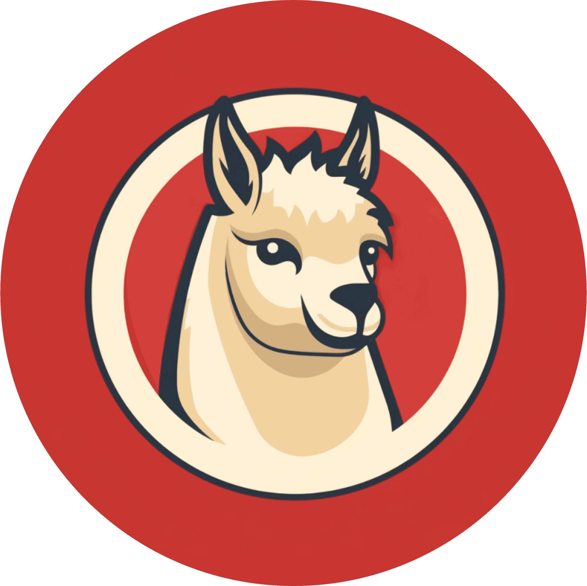
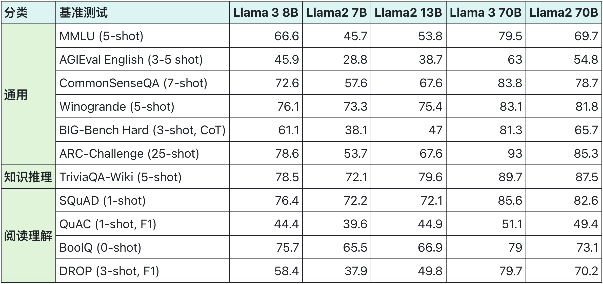
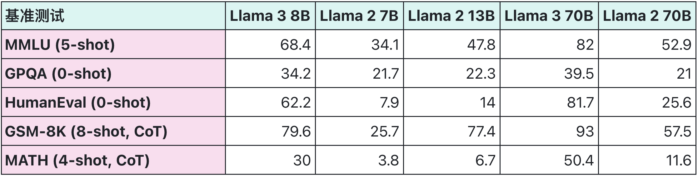
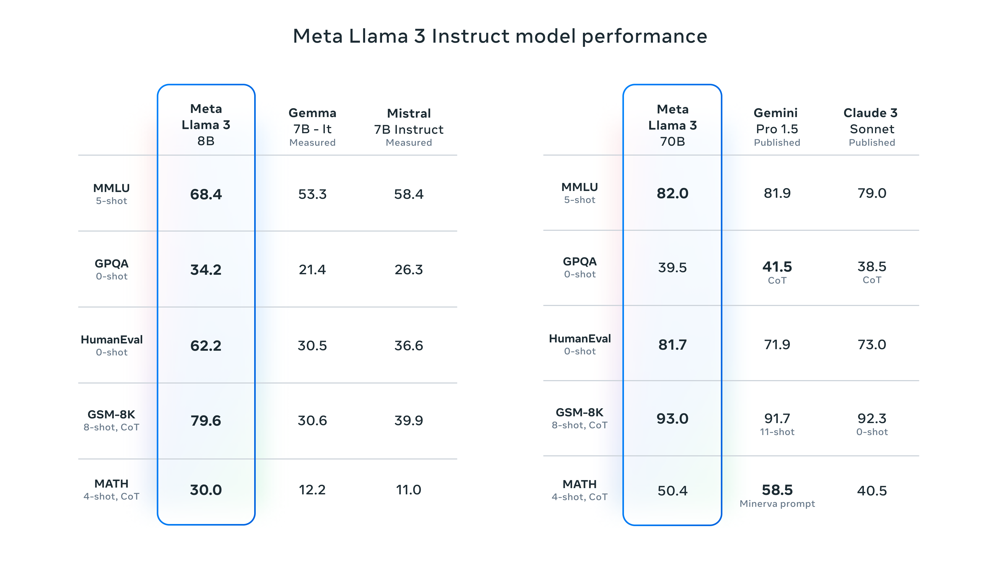

<p align="left">
    <a href="README_EN.md">English</a> ｜ 中文
</p>

<h1 align="center">
  Llama中文社区
</h1>
<p align="center" width="100%">
  </a>
</p>
<p align="center">
  <font face="黑体" color=orange size="6"> Llama3体验和微调已开放，最好的中文Llama大模型 </font>
</p>

<p align="center">
🤗 <a href="https://huggingface.co/FlagAlpha" target="_blank">Hugging Face</a> • 🤖 <a href="https://www.modelscope.cn/organization/FlagAlpha/" target="_blank">ModelScope</a> • ✡️ <a href="https://wisemodel.cn/models/FlagAlpha/Atom-7B-Chat" target="_blank">WiseModel</a>
</p> 

<p align="center">
  <a href="https://llama.family">Llama3.1 在线体验（包含Llama2）：https://llama.family</a>
</p>
<p align="center">
  <a href="https://huggingface.co/FlagAlpha/Atom-7B-Chat">基于Llama的开源中文预训练大模型Atom</a>
</p>

</br></br>


## 🗂️ 目录
- [📌 Llama中文社区](#-llama中文社区)
  * [🔥 社区介绍：Llama中文社区](#-社区介绍llama中文社区)
  * [📢 最新动态](#-最新动态)
  * [🤗 模型](#-模型)
    + [🤗 中文预训练模型Atom-7B](#-中文预训练模型atom)
    + [🤗 Llama3官方模型](#llama3官方模型)
    + [🤗 Llama3中文微调模型](#llama3中文微调模型)
    + [🤗 Llama2官方模型](#llama2官方模型)
    + [🤗 Llama2中文微调模型](#llama2中文微调模型)
  * [🌟 社区资源](#社区资源)


- [📌 如何使用Llama模型?](#-如何使用llama模型)
  - [快速上手-使用Anaconda](#快速上手-使用anaconda)
  - [快速上手-使用Docker](#快速上手-使用docker)
  - [快速上手-使用llama.cpp](#快速上手-使用llamacpp)
  - [快速上手-使用gradio](#快速上手-使用gradio)
  - [快速上手-构建API服务](#快速上手-构建api服务)
  - [快速上手-使用ollama运行](#快速上手-使用ollama运行)

+ [🤖 模型预训练](#-模型预训练)
+ [💡 模型微调](#-模型微调)
  - [Step1: 环境准备](#step1-环境准备)
  - [Step2: 数据准备](#step2-数据准备)
  - [Step3: 微调脚本](#step3-微调脚本)
    * [LoRA微调](#lora微调)
    * [全量参数微调](#全量参数微调)
  - [Step4: 加载微调模型](#step4-加载微调模型)
    * [LoRA微调](#lora微调-1)
    * [全量参数微调](#全量参数微调-1)
+ [🍄 模型量化](#-模型量化)

+ [🚀 部署加速](#-部署加速)
  - [TensorRT-LLM](#tensorrt-llm)
  - [vLLM](#vllm)  
  - [JittorLLMs](#jittorllms)
  - [lmdeploy](#lmdeploy)

+ [💪 外延能力](#-外延能力)
  - [LangChain](#langchain)
    
* [🥇 模型评测](#-模型评测)
  + [Llama2和Llama3对比评测](#llama2和llama3对比评测)
  + [Llama3模型评测](#llama3模型评测)
  + [Llama2模型评测](#llama2模型评测)

* [📖 学习中心](#-学习中心)
    + [Llama3](#llama3)
    + [Llama2](#llama2)
      - [Meta官方对于Llama2的介绍](#meta官方对于llama2的介绍)
    + [Llama相关论文](#llama相关论文)

- [📌 其它](#-其它)
  * [🎉 致谢](#-致谢)
  * [🤔 问题反馈](#-问题反馈)

## 📌 Llama中文社区

### 🔥 社区介绍：llama中文社区

欢迎来到Llama中文社区！我们是一个专注于Llama模型在中文方面的优化和上层建设的高级技术社区。
**已经基于大规模中文数据，从预训练开始对Llama2模型进行中文能力的持续迭代升级【Done】**。**正在对Llama3模型进行中文能力的持续迭代升级【Doing】**
我们热忱欢迎对大模型LLM充满热情的开发者和研究者加入我们的行列。

<details>

#### 为什么选择Llama中文社区？
🚀 **高级工程师团队支持**：社区有一批专注为大家服务的NLP高级工程师，我们有着强大的技术支持和丰富的经验，为您提供专业的指导和帮助。

🎯 **中文优化**：我们致力于在Llama模型的中文处理方面进行优化，探索适用于中文的最佳实践，以提升其性能和适应性【支持Llama2、Llama3】。

💡 **创新交流**：我们拥有一支富有创造力和经验的社区成员团队，定期组织线上活动、技术研讨和经验分享，促进成员间的创新交流。

🌐 **全球联结**：我们欢迎来自世界各地的开发者加入社区，构建一个开放、多元化的学习和交流平台。

🤝 **开放共享**：我们鼓励社区成员开源分享代码和模型，推动合作共赢，共同促进中文NLP技术的发展。

#### 社区活动
🗓️ **线上讲座**：邀请行业内专家进行线上讲座，分享Llama在中文NLP领域的最新技术和应用，探讨前沿研究成果。

💻 **项目展示**：成员可展示自己在Llama中文优化方面的项目成果，获得反馈和建议，促进项目协作。

📚 **学习资源**：社区维护丰富的学习资料库，包括教程、文档和论文解读，为成员提供全面的学习支持。

📝 **论文解读**：社区成员共同解读与Llama相关的最新研究论文，深入理解前沿算法和方法。

🎉 **主题活动**：定期举办各类主题活动，包括挑战赛、黑客马拉松和技术沙龙，让社区成员在轻松愉快的氛围中交流和学习。

🌟 **奖励计划**：我们设立奖励计划，对社区中积极参与、贡献优秀的成员给予荣誉和奖励，激励更多优秀人才的加入。

📈 **技术咨询**：我们提供技术咨询服务，解答您在Llama开发和优化过程中遇到的问题，助您快速攻克难关。

🚀 **项目合作**：鼓励成员间的项目合作，共同探索Llama在实际应用中的潜力，打造创新解决方案。


#### 立即加入我们！
📚 **愿景**：无论您是对Llama已有研究和应用经验的专业开发者，还是对Llama中文优化感兴趣并希望深入探索的新手，我们都热切期待您的加入。在Llama中文社区，您将有机会与行业内顶尖人才共同交流，携手推动中文NLP技术的进步，开创更加美好的技术未来！

🔗 **温馨提示**：本社区为专业技术交流平台，我们热切期望志同道合的开发者和研究者加入。请遵守社区准则，共同维护积极向上的学习氛围。感谢您的理解和支持！

</details>

### 📢 最新动态

【最新】2024年07月24日：开源最强[Llama 3.1](https://llama.meta.com/docs/overview)模型发布，包含8B、70B和405B！

【最新】2024年07月16日：[社区论坛](https://forum.llamafamily.cn/)上线，有大模型问题，就找Llama中文社区！

【最新】2024年05月15日：支持ollama运行Llama3-Chinese-8B-Instruct、Atom-7B-Chat，[详细使用方法](https://github.com/LlamaFamily/Llama-Chinese?tab=readme-ov-file#%E5%BF%AB%E9%80%9F%E4%B8%8A%E6%89%8B-%E4%BD%BF%E7%94%A8ollama%E8%BF%90%E8%A1%8C)。

【最新】2024年04月23日：社区增加了llama3 8B中文微调模型[Llama3-Chinese-8B-Instruct](https://github.com/LlamaFamily/Llama-Chinese?tab=readme-ov-file#llama3%E4%B8%AD%E6%96%87%E5%BE%AE%E8%B0%83%E6%A8%A1%E5%9E%8B)以及对应的[免费API调用](https://llama.family/docs/chat-completion-v1)。
 
【最新】2024年04月19日：社区增加了llama3 8B、llama3 70B[在线体验链接](https://llama.family/chat/#/)。

【最新】2024年04月14日：社区更新了四个专家角色：心理咨询师、羊驼夸夸 、律师、医生。链接：[角色role](https://llama.family/tools/#/agent)。

【最新】2024年04月10日：Atom-7B-Chat 模型回答内容相较之前更为丰富、增强了模型的指令遵循能力和回答稳定性、优化了ppo的奖励模型。下载链接[modelscope](https://modelscope.cn/models/FlagAlpha/Atom-7B-Chat)、[Huggingface](https://huggingface.co/FlagAlpha/Atom-7B-Chat)。

【最新】2024年04月01日：社区上线了Llama中文[应用平台](https://llama.family/store)；同时如果你有优秀的的应用需要推广可以填写[申请表](https://atomecho.feishu.cn/share/base/form/shrcnFqpN71OmBoXDCT6y0TQgIc)。

【最新】2024年03月08日：开放了免费API供大家使用，包含（Atom-1B,7B,13B 3种中文大模型）[API使用链接](https://llama.family/docs/chat-completion-v1)

【最新】2024年04月14日：社区更新了四个专家角色：心理咨询师、羊驼夸夸 、律师、医生。链接：[角色role](https://llama.family/tools/#/agent)。

【最新】2024年04月10日：Atom-7B-Chat 模型回答内容相较之前更为丰富、增强了模型的指令遵循能力和回答稳定性、优化了ppo的奖励模型。下载链接[modelscope](https://modelscope.cn/models/FlagAlpha/Atom-7B-Chat)、[Huggingface](https://huggingface.co/FlagAlpha/Atom-7B-Chat)。

【最新】2024年04月01日：社区上线了Llama中文[应用平台](https://llama.family/store)；同时如果你有优秀的的应用需要推广可以填写[申请表](https://atomecho.feishu.cn/share/base/form/shrcnFqpN71OmBoXDCT6y0TQgIc)。

【最新】2024年03月28日：[社区免费公开课](https://mp.weixin.qq.com/s/CsturoU1pOX11CqVnZgu2A)。

【最新】2024年03月08日：开放了免费API供大家使用，包含（Atom-1B,7B,13B 3种中文大模型）[API使用链接](https://llama.family/docs/chat-completion-v1)

【最新】2023年10月8日：新增清华大学JittorLLMs的推理加速功能[JittorLLMs](#jittorllms)！

<details>

- 2023年9月12日：更新预训练版本[Atom-7B](https://huggingface.co/FlagAlpha/Atom-7B)和对话版本[Atom-7B-Chat](https://huggingface.co/FlagAlpha/Atom-7B-Chat)模型参数，最新的中文预训练数据量为2.7TB token，训练进程见[llama.family](https://llama.family/)！

- 2023年9月2日：新增模型[预训练代码](#-模型预训练)和[全量参数微调代码](#-模型微调)！
  
- 2023年8月28日：发布基于Llama2进行中文预训练的开源大模型[Atom-7B](https://huggingface.co/FlagAlpha/Atom-7B)，并将持续更新，详情参考[社区公众号文章](https://mp.weixin.qq.com/s/Bdx0JTVh1kgPn5ydYxIkEw)！

- 2023年8月26日：提供[FastAPI](#fastapi接口搭建)接口搭建脚本！

- 2023年8月26日：提供将Meta原始模型参数转换为兼容Hugging Face的[格式转化脚本](https://github.com/LlamaFamily/Llama-Chinese/blob/main/scripts/convert2hf/README.md)！

- 2023年8月26日：新增[Code Llama](#-代码模型)模型！

- 2023年8月15日：新增[PEFT加载微调模型参数](#加载微调模型)的代码示例！

- 2023年8月14日：[大模型数据共享训练平台](https://llama.family)上线，没有算力也能参与大模型训练，社区每位成员贡献的数据都将决定模型能力的未来走向！

- 2023年8月3日：新增FasterTransformer和vLLM的GPU[推理加速](#-推理加速)支持！

- 2023年7月31日：【重磅】国内首个真正意义上的Llama2中文大模型发布！详情参见[社区公众号文章](https://mp.weixin.qq.com/s/lExUU7z_MvgJ7tzQPF8tUQ)

- 2023年7月28日：通过[Docker部署](#docker部署问答接口)问答接口！

- 2023年7月27日：新增[LangChain](#langchain)支持！

- 2023年7月26日：新增Llama2-13B中文微调参数的[4bit量化压缩版本](#-模型量化)！

- 2023年7月25日：社区微信公众号“Llama中文社区”欢迎大家关注，获取最新分享和动态！

- 2023年7月24日：[FlagAlpha](https://huggingface.co/FlagAlpha)新增Llama2-13B中文微调参数！

- 2023年7月24日：[llama.family](https://llama.family/)新增Llama2-70B在线体验！

- 2023年7月23日：Llama2中文微调参数发布至Hugging Face仓库[FlagAlpha](https://huggingface.co/FlagAlpha)！

- 2023年7月22日：Llama2在线体验链接[llama.family](https://llama.family/)上线，同时包含Meta原版和中文微调版本！

- 2023年7月21日：评测了Meta原始版Llama2 Chat模型的[中文问答能力](#-模型评测)！

- 2023年7月21日：新增Llama2模型的Hugging Face版本国内下载地址！

- 2023年7月20日：新增[飞书知识库文档](https://chinesellama.feishu.cn/wiki/space/7257824476874768388?ccm_open_type=lark_wiki_spaceLink)，欢迎大家一起共建！

- 2023年7月20日：国内Llama2最新下载地址上线！

- 2023年7月19日：正式启动Llama2模型的中文预训练，关注我们获取实时动态！

- 2023年7月19日：Llama2国内下载地址正在启动，敬请期待！

- 2023年7月19日：开启Llama2中文社区，欢迎大家加入！

</details>


### 🤗 模型

#### 🔵 中文预训练模型Atom

**原子大模型Atom**由Llama中文社区和原子回声联合打造。

|  类别  | 模型名称        | 🤗模型加载名称                  | 下载地址                                                     |
| --------------- | --------------- | ------------------------------ | ------------------------------------------------------------ |
|  预训练  | Atom-7B  | FlagAlpha/Atom-7B  | [HuggingFace](https://huggingface.co/FlagAlpha/Atom-7B) \| [ModelScope](https://modelscope.cn/models/FlagAlpha/Atom-7B) \| [WiseModel](https://wisemodel.cn/models/FlagAlpha/Atom-7B) |
|  Chat  | Atom-7B-Chat  | FlagAlpha/Atom-7B-Chat  | [HuggingFace](https://huggingface.co/FlagAlpha/Atom-7B-Chat) \| [ModelScope](https://modelscope.cn/models/FlagAlpha/Atom-7B-Chat) \| [WiseModel](https://wisemodel.cn/models/FlagAlpha/Atom-7B-Chat)|

Atom系列模型包含Atom-13B、Atom-7B和Atom-1B，基于Llama2做了中文能力的持续优化。Atom-7B和Atom-7B-Chat目前已完全开源，支持商用，可在[Hugging Face](https://huggingface.co/FlagAlpha)仓库获取模型，详情见[Atom-7B下载](#基于llama2的中文预训练模型atom)。Atom大模型针对中文做了以下优化：

- 大规模的中文数据预训练

原子大模型Atom在Llama2的基础上，采用大规模的中文数据进行持续预训练，包含百科、书籍、博客、新闻、公告、小说、金融数据、法律数据、医疗数据、代码数据、专业论文数据、中文自然语言处理竞赛数据集等，详见[📝 数据来源](#-数据来源)。

同时对庞大的数据进行了过滤、打分、去重，筛选出超过1T token的高质量中文数据，持续不断加入训练迭代中。

- 更高效的中文词表
为了提高中文文本处理的效率，我们针对Llama2模型的词表进行了深度优化。首先，我们基于数百G的中文文本，在该模型词表的基础上扩展词库至65,000个单词。经过测试，我们的改进使得中文编码/解码速度提高了约350％。此外，我们还扩大了中文字符集的覆盖范围，包括所有emoji符号😊。这使得生成带有表情符号的文章更加高效。

- 自适应上下文扩展
Atom大模型默认支持4K上下文，利用位置插值PI和Neural Tangent Kernel （NTK）方法，经过微调可以将上下文长度扩增到32K。

- 📝 中文数据

我们通过以下数据来优化Llama2的中文能力:

| 类型                                                       | 描述                                                         |
| ---------------------------------------------------------- | ------------------------------------------------------------ |
| 网络数据                                                   | 互联网上公开的网络数据，挑选出去重后的高质量中文数据，涉及到百科、书籍、博客、新闻、公告、小说等高质量长文本数据。 |
| [Wikipedia](https://github.com/goldsmith/Wikipedia)        | 中文Wikipedia的数据                                          |
| [悟道](https://github.com/BAAI-WuDao/Model)                | 中文悟道开源的200G数据                                       |
| [Clue](https://github.com/CLUEbenchmark/CLUEDatasetSearch) | Clue开放的中文预训练数据，进行清洗后的高质量中文长文本数据   |
| 竞赛数据集                                                 | 近年来中文自然语言处理多任务竞赛数据集，约150个              |
| [MNBVC](https://github.com/esbatmop/MNBVC)                 | MNBVC 中清洗出来的部分数据集

社区提供预训练版本Atom-7B和基于Atom-7B进行对话微调的模型参数供开放下载，关于模型的进展详见社区官网[llama.family](https://llama.family)。

#### Llama3官方模型

|  类别  | 模型名称   | 🤗模型加载名称             | 下载地址                                                     |
|  ----------  | ---------- | ------------------------- | --------------------- |
|  预训练  | Llama3-8B  | meta-llama/Meta-Llama-3-8B  | [HuggingFace](https://huggingface.co/meta-llama/Meta-Llama-3-8B) \| [百度网盘](https://pan.baidu.com/s/1gBZ7wEn3gC8VRok0Onh9BQ?pwd=8frq) |
|  预训练  | Llama3-70B | meta-llama/Meta-Llama-3-70B | [HuggingFace](https://huggingface.co/meta-llama/Meta-Llama-3-7B) \| [百度网盘](https://pan.baidu.com/s/1gBZ7wEn3gC8VRok0Onh9BQ?pwd=8frq) |
|  对话模型  | Llama3-8B-Chat  | meta-llama/Meta-Llama-3-8B-Instruct  | [HuggingFace](https://huggingface.co/meta-llama/Meta-Llama-3-8B-Instruct) \| [百度网盘](https://pan.baidu.com/s/1gBZ7wEn3gC8VRok0Onh9BQ?pwd=8frq) |
|  对话模型  | Llama3-70B-Chat  | meta-llama/Meta-Llama-3-70B-Instruct  | [HuggingFace](https://huggingface.co/meta-llama/Meta-Llama-3-70B-Instruct) \| [百度网盘](https://pan.baidu.com/s/1gBZ7wEn3gC8VRok0Onh9BQ?pwd=8frq) |

#### Llama3中文微调模型

|  类别  | 模型名称   | 🤗模型加载名称             | 下载地址                                                     |
|  ----------  | ---------- | ------------------------- | --------------------- |
|  对话模型  | Llama3-Chinese-8B-Instruct  | FlagAlpha/Llama3-Chinese-8B-Instruct  | [HuggingFace](https://huggingface.co/FlagAlpha/Llama3-Chinese-8B-Instruct) \| [modelscope](https://modelscope.cn/models/FlagAlpha/Llama3-Chinese-8B-Instruct/summary) \| [wisemodel](https://wisemodel.cn/models/FlagAlpha/Llama3-Chinese-8B-Instruct/file) |


#### Llama2官方模型

<details>

|  类别  | 模型名称   | 🤗模型加载名称             | 下载地址                                                     |
|  ----------  | ---------- | ------------------------- | --------------------- |
|  预训练  | Llama2-7B  | meta-llama/Llama-2-7b-hf  | [HuggingFace](https://huggingface.co/meta-llama/Llama-2-7b-hf) \| [迅雷网盘](https://pan.xunlei.com/s/VN_t0dUikZqOwt-5DZWHuMvqA1?pwd=66ep) |
|  预训练  | Llama2-13B | meta-llama/Llama-2-13b-hf | [HuggingFace](https://huggingface.co/meta-llama/Llama-2-13b-hf) \| [迅雷网盘](https://pan.xunlei.com/s/VN_yT_9G8xNOz0SDWQ7Mb_GZA1?pwd=yvgf) |
|  预训练  | Llama2-70B | meta-llama/Llama-2-70b-hf | [HuggingFace](https://huggingface.co/meta-llama/Llama-2-70b-hf) |
|  Chat  | Llama2-7B-Chat  | meta-llama/Llama-2-7b-chat-hf  | [HuggingFace](https://huggingface.co/meta-llama/Llama-2-7b-chat-hf) \| [迅雷网盘](https://pan.xunlei.com/s/VN_oaV4BpKFgKLto4KgOhBcaA1?pwd=ufir) |
|  Chat  | Llama2-13B-Chat | meta-llama/Llama-2-13b-chat-hf | [HuggingFace](https://huggingface.co/meta-llama/Llama-2-13b-chat-hf) \| [迅雷网盘](https://pan.xunlei.com/s/VN_yA-9G34NGL9B79b3OQZZGA1?pwd=xqrg) |
|  Chat  | Llama2-70B-Chat | meta-llama/Llama-2-70b-chat-hf | [HuggingFace](https://huggingface.co/meta-llama/Llama-2-70b-chat-hf) \| [迅雷网盘](https://pan.xunlei.com/s/VNa_vCGzCy3h3N7oeFXs2W1hA1?pwd=uhxh#) |
| Code  | CodeLlama-7b    |   meta-llama/Llama-2-70b-chat-hf              | [迅雷网盘](https://pan.baidu.com/s/1cIPzdNywWLvQI7_2QanOEQ?pwd=zfwi) |
| Code  | CodeLlama-7b-Python    |   meta-llama/Llama-2-70b-chat-hf              | [迅雷网盘](https://pan.baidu.com/s/1liY8klGoDagYbpw-g-oFag?pwd=i952) |
| Code  | CodeLlama-7b-Instruct    |   meta-llama/Llama-2-70b-chat-hf              | [迅雷网盘](https://pan.baidu.com/s/108o9_DT2E_vfSGtOnDCQVw?pwd=zkt9) |
| Code  | CodeLlama-13b    |   meta-llama/Llama-2-70b-chat-hf              | [迅雷网盘](https://pan.baidu.com/s/1lLaeHv0XEBv0iiZzI1dpnw?pwd=qn99) |
| Code  | CodeLlama-13b-Python    |   meta-llama/Llama-2-70b-chat-hf              | [迅雷网盘](https://pan.baidu.com/s/1OLVfvZS_oqL3oqMKwsI87w?pwd=a78k) |
| Code  | CodeLlama-13b-Instruct    |   meta-llama/Llama-2-70b-chat-hf              | [迅雷网盘](https://pan.baidu.com/s/1HyxJl4w8wElgkZRh2ATrXQ?pwd=seg6) |
| Code  | CodeLlama-34b    |   meta-llama/Llama-2-70b-chat-hf              | [迅雷网盘](https://pan.baidu.com/s/1vEw0pFgIkctPUN4_5_6pIQ?pwd=q8eu) |

Meta官方在2023年8月24日发布了Code Llama，基于代码数据对Llama2进行了微调，提供三个不同功能的版本：基础模型（Code Llama）、Python专用模型（Code Llama - Python）和指令跟随模型（Code Llama - Instruct），包含7B、13B、34B三种不同参数规模。不同模型能力区别如下表所示：

|  模型类别          |        模型名称         | 代码续写 | 代码填充 | 指令编程 |
|-----------------------|------------------------|------|------|------|
| Code Llama            | CodeLlama-7b           | ✅    | ✅    | ❌    |
|                       | CodeLlama-13b          | ✅    | ✅    | ❌    |
|                       | CodeLlama-34b          | ✅    | ❌    | ❌    |
| Code Llama - Python   | CodeLlama-7b-Python    | ✅    | ❌    | ❌    |
|                       | CodeLlama-13b-Python   | ✅    | ❌    | ❌    |
|                       | CodeLlama-34b-Python   | ✅    | ❌    | ❌    |
| Code Llama - Instruct | CodeLlama-7b-Instruct  | ❌    | ✅    | ✅    |
|                       | CodeLlama-13b-Instruct | ❌    | ✅    | ✅    |
|                       | CodeLlama-34b-Instruct | ❌    | ❌    | ✅    |

关于Code Llama的详细信息可以参考官方Github仓库[codellama](https://github.com/facebookresearch/codellama)。

</details>

#### Llama2中文微调模型

我们基于中文指令数据集对Llama2-Chat模型进行了微调，使得Llama2模型有着更强的中文对话能力。LoRA参数以及与基础模型合并的参数均已上传至[Hugging Face](https://huggingface.co/FlagAlpha)，目前包含7B和13B的模型。

|  类别  | 模型名称   | 🤗模型加载名称             | 基础模型版本 |    下载地址                                                     |
|  ----------  | ---------- | ------------- |  ----------------- | ------------------- |
|  合并参数 | Llama2-Chinese-7b-Chat | FlagAlpha/Llama2-Chinese-7b-Chat  |    meta-llama/Llama-2-7b-chat-hf       |[HuggingFace](https://huggingface.co/FlagAlpha/Llama2-Chinese-7b-Chat)  |
|  合并参数 | Llama2-Chinese-13b-Chat | FlagAlpha/Llama2-Chinese-13b-Chat|     meta-llama/Llama-2-13b-chat-hf     |[HuggingFace](https://huggingface.co/FlagAlpha/Llama2-Chinese-13b-Chat) |
|  LoRA参数 | Llama2-Chinese-7b-Chat-LoRA  | FlagAlpha/Llama2-Chinese-7b-Chat-LoRA  |     meta-llama/Llama-2-7b-chat-hf      |[HuggingFace](https://huggingface.co/FlagAlpha/Llama2-Chinese-7b-Chat-LoRA) |
|  LoRA参数 | Llama2-Chinese-13b-Chat-LoRA | FlagAlpha/Llama2-Chinese-13b-Chat-LoRA |     meta-llama/Llama-2-13b-chat-hf     |[HuggingFace](https://huggingface.co/FlagAlpha/Llama2-Chinese-13b-Chat-LoRA) |


### 社区资源
社区资源的丰富性是社区发展的重要保障，它涵盖了各种方面，其中包括但不限于以下四个方面：算力、数据、论坛和应用。在这些方面的积极发展与充分利用，将为社区成员提供更多的机会和支持，推动整个社区向着更加繁荣的方向发展。更多的内容请看[llama.family](https://llama.family/)

<details>

#### 💻 算力
- 提供低于市场价格的算力资源，可用于各类计算任务，如深度学习模型的训练、推理等。
- 为社区成员提供专属的在线推理服务，让用户可以快速有效地对模型进行推理操作。
- 提供一键在线微调服务，使用户可以方便地对模型进行微调，以适应不同的任务和数据。

#### 📊 数据
- 开放丰富的训练数据资源，覆盖多个领域和行业，为模型训练提供充足的数据支持。
- 提供高质量、多样化的数据集，以满足不同用户的需求，并支持数据共享和交流，促进数据资源的充分利用。

#### 💬 论坛
- 社区论坛为社区成员提供了一个在线交流和讨论技术问题的平台。
- 在论坛上，用户可以分享经验、提出问题、解答疑惑，促进技术交流和合作。
- 论坛还可以定期举办线上活动、研讨会等，增进社区成员之间的联系和了解。

#### 📱 应用
- 免费提供应用推广展示位，让开发者可以将他们的应用充分展示给社区成员。
- 提供推广的帮助，包括但不限于宣传推广、用户引导等服务，帮助应用获得更多的曝光和用户。
- 通过社区平台，为优秀的应用提供合作机会，促进应用开发者之间的合作和交流，共同推动应用的发展和壮大。

</details>

## 📌 如何使用Llama模型?


你可以选择下面的快速上手的任一种方式，开始使用 Llama 系列模型。推荐使用[中文预训练对话模型](#llama2中文预训练模型atom-7b)进行使用，对中文的效果支持更好。


### 快速上手-使用Anaconda

第 0 步：前提条件
- 确保安装了 Python 3.10 以上版本。

第 1 步：准备环境

如需设置环境，安装所需要的软件包，运行下面的命令。
```bash
git clone https://github.com/LlamaFamily/Llama-Chinese.git
cd Llama-Chinese
pip install -r requirements.txt
```

第 2 步：下载模型

你可以从以下来源下载Atom-7B-Chat模型。
- [HuggingFace](https://huggingface.co/FlagAlpha)
- [ModelScope](https://modelscope.cn/organization/FlagAlpha)
- [WiseModel](https://wisemodel.cn/models/FlagAlpha/Atom-7B-Chat)

第 3 步：进行推理

使用Atom-7B-Chat模型进行推理
创建一个名为 quick_start.py 的文件，并将以下内容复制到该文件中。
```python
import torch
from transformers import AutoTokenizer, AutoModelForCausalLM
device_map = "cuda:0" if torch.cuda.is_available() else "auto"
model = AutoModelForCausalLM.from_pretrained('FlagAlpha/Atom-7B-Chat',device_map=device_map,torch_dtype=torch.float16,load_in_8bit=True,trust_remote_code=True,use_flash_attention_2=True)
model =model.eval()
tokenizer = AutoTokenizer.from_pretrained('FlagAlpha/Atom-7B-Chat',use_fast=False)
tokenizer.pad_token = tokenizer.eos_token
input_ids = tokenizer(['<s>Human: 介绍一下中国\n</s><s>Assistant: '], return_tensors="pt",add_special_tokens=False).input_ids
if torch.cuda.is_available():
  input_ids = input_ids.to('cuda')
generate_input = {
    "input_ids":input_ids,
    "max_new_tokens":512,
    "do_sample":True,
    "top_k":50,
    "top_p":0.95,
    "temperature":0.3,
    "repetition_penalty":1.3,
    "eos_token_id":tokenizer.eos_token_id,
    "bos_token_id":tokenizer.bos_token_id,
    "pad_token_id":tokenizer.pad_token_id
}
generate_ids  = model.generate(**generate_input)
text = tokenizer.decode(generate_ids[0])
print(text)
```

运行 quick_start.py 代码。
```bash
python quick_start.py
```

### 快速上手-使用Docker

详情参见：[Docker部署](https://github.com/LlamaFamily/Llama-Chinese/blob/main/docs/chat_gradio_guide.md)

第 1 步：准备docker镜像，通过docker容器启动[chat_gradio.py](../examples/chat_gradio.py)
```bash
git clone https://github.com/LlamaFamily/Llama-Chinese.git

cd Llama-Chinese

docker build -f docker/Dockerfile -t flagalpha/llama2-chinese:gradio .
```

第 2 步：通过docker-compose启动chat_gradio
```bash
cd Llama-Chinese/docker
docker-compose up -d --build
```

### 快速上手-使用llama.cpp
详情参见：[使用llama.cpp](https://github.com/LlamaFamily/Llama-Chinese/blob/main/inference-speed/CPU/ggml/README.md)

### 快速上手-使用gradio
基于gradio搭建的问答界面，实现了流式的输出，将下面代码复制到控制台运行，以下代码以Atom-7B-Chat模型为例，不同模型只需修改一下面的model_name_or_path对应的模型名称就好了😊
```
python examples/chat_gradio.py --model_name_or_path FlagAlpha/Atom-7B-Chat
```

### 快速上手-构建API服务
使用FastChat构建和OpenAI一致的推理服务接口。

<details>
第 0 步：前提条件

安装fastchat
```bash
pip3 install "fschat[model_worker,webui]"
```
第 1 步：启动Restful API

开启三个控制台分别执行下面的三个命令
- 首先启动controler
```bash
python3 -m fastchat.serve.controller \
--host localhost \
--port 21001
```

- 启动模型
```bash
CUDA_VISIBLE_DEVICES="0" python3 -m fastchat.serve.model_worker --model-path /path/Atom-7B-Chat \
--host localhost \
--port 21002 \
--worker-address "http://localhost:21002" \
--limit-worker-concurrency 5 \
--stream-interval 2 \
--gpus "1" \
--load-8bit
```

- 启动RESTful API 服务
```bash
python3 -m fastchat.serve.openai_api_server \
--host localhost \
--port 21003 \
--controller-address http://localhost:21001
```

第 2 步：测试api服务

执行下面的python代码测试上面部署的api服务
```python
# coding=utf-8
import json
import time
import urllib.request
import sys
import requests

def test_api_server(input_text):
    header = {'Content-Type': 'application/json'}

    data = {
          "messages": [{"role": "system", "content": ""}, {"role": "user", "content": input_text}],
          "temperature": 0.3, 
          "top_p" : 0.95, 
          "max_tokens": 512, 
          "model": "LLama2-Chinese-13B",
          "stream" : False,
          "n" : 1,
          "best_of": 1, 
          "presence_penalty": 1.2, 
          "frequency_penalty": 0.2,           
          "top_k": 50, 
          "use_beam_search": False, 
          "stop": [], 
          "ignore_eos" :False,
          "logprobs": None
    }
    response = requests.post(
        url='http://127.0.0.1:21003/v1/chat/completions',
        headers=header,
        data=json.dumps(data).encode('utf-8')
    )

    result = None
    try:
        result = json.loads(response.content)
        print(json.dumps(data, ensure_ascii=False, indent=2))
        print(json.dumps(result, ensure_ascii=False, indent=2))

    except Exception as e:
        print(e)

    return result

if __name__ == "__main__":
    test_api_server("如何去北京?")
```

</details>


### 快速上手-使用ollama运行

1. 首先需要安装ollama工具

安装方法参考：[https://ollama.com](https://ollama.com/)

2. ollama运行Llama3-Chinese-8B-Instruct、Atom-7B-Chat

ollama运行基于Llama3进行中文微调的大模型[Llama3-Chinese-8B-Instruct](https://huggingface.co/FlagAlpha/Llama3-Chinese-8B-Instruct)

打开命令行执行命令
```
ollama run llamafamily/llama3-chinese-8b-instruct
```

ollama运行基于Llama2进行中文预训练的开源大模型[Atom-7B-Chat](https://huggingface.co/FlagAlpha/Atom-7B-Chat)

打开命令行执行命令
```
ollama run llamafamily/atom-7b-chat
```


## 🤖 模型预训练
虽然Llama2的预训练数据相对于第一代LLaMA扩大了一倍，但是中文预训练数据的比例依然非常少，仅占0.13%，这也导致了原始Llama2的中文能力较弱。为了能够提升模型的中文能力，可以采用微调和预训练两种路径，其中：
- 微调需要的算力资源少，能够快速实现一个中文Llama的雏形。但缺点也显而易见，只能激发基座模型已有的中文能力，由于Llama2的中文训练数据本身较少，所以能够激发的能力也有限，治标不治本。

- 基于大规模中文语料进行预训练，成本高，不仅需要大规模高质量的中文数据，也需要大规模的算力资源。但是优点也显而易见，就是能从模型底层优化中文能力，真正达到治本的效果，从内核为大模型注入强大的中文能力。

我们为社区提供了Llama模型的预训练代码，以及[中文测试语料](https://github.com/LlamaFamily/Llama-Chinese/tree/main/data)，更多数据可以参考[中文语料](#-中文数据)。具体代码和配置如下：
- 模型预训练脚本：[train/pretrain/pretrain.sh](https://github.com/LlamaFamily/Llama-Chinese/blob/main/train/pretrain/pretrain.sh)
- 预训练实现代码：[train/pretrain/pretrain_clm.py](https://github.com/LlamaFamily/Llama-Chinese/blob/main/train/pretrain/pretrain_clm.py)
- [DeepSpeed](https://github.com/microsoft/DeepSpeed)加速：
  - 对于单卡训练，可以采用ZeRO-2的方式，参数配置见 [train/pretrain/ds_config_zero2.json](https://github.com/LlamaFamily/Llama-Chinese/blob/main/train/pretrain/ds_config_zero2.json)
  - 对于多卡训练，可以采用ZeRO-3的方式，参数配置见 [train/pretrain/ds_config_zero3.json](https://github.com/LlamaFamily/Llama-Chinese/blob/main/train/pretrain/ds_config_zero3.json)
- 训练效果度量指标：[train/pretrain/accuracy.py](https://github.com/LlamaFamily/Llama-Chinese/blob/main/train/pretrain/accuracy.py)

## 💡 模型微调

本仓库中同时提供了LoRA微调和全量参数微调代码，关于LoRA的详细介绍可以参考论文“[LoRA: Low-Rank Adaptation of Large Language Models](https://arxiv.org/abs/2106.09685)”以及微软Github仓库[LoRA](https://github.com/microsoft/LoRA)。

### Step1: 环境准备

根据[requirements.txt](https://github.com/LlamaFamily/Llama-Chinese/blob/main/requirements.txt)安装对应的环境依赖。

### Step2: 数据准备
在data目录下提供了一份用于模型sft的数据样例：
- 训练数据：[data/train_sft.csv](https://github.com/LlamaFamily/Llama-Chinese/blob/main/data/train_sft.csv)
- 验证数据：[data/dev_sft.csv](https://github.com/LlamaFamily/Llama-Chinese/blob/main/data/dev_sft.csv)

每个csv文件中包含一列“text”，每一行为一个训练样例，每个训练样例按照以下格式将问题和答案组织为模型输入，您可以按照以下格式自定义训练和验证数据集：
```
"<s>Human: "+问题+"\n</s><s>Assistant: "+答案+"\n"</s>
```
例如，
```
<s>Human: 用一句话描述地球为什么是独一无二的。</s><s>Assistant: 因为地球是目前为止唯一已知存在生命的行星。</s>
```

### Step3: 微调脚本

#### LoRA微调
LoRA微调脚本见：[train/sft/finetune_lora.sh](https://github.com/LlamaFamily/Llama-Chinese/blob/main/train/sft/finetune_lora.sh)，关于LoRA微调的具体实现代码见[train/sft/finetune_clm_lora.py](https://github.com/LlamaFamily/Llama-Chinese/blob/main/train/sft/finetune_clm_lora.py)，单机多卡的微调可以通过修改脚本中的`--include localhost:0`来实现。

#### 全量参数微调
全量参数微调脚本见：[train/sft/finetune.sh](https://github.com/LlamaFamily/Llama-Chinese/blob/main/train/sft/finetune.sh)，关于全量参数微调的具体实现代码见[train/sft/finetune_clm.py](https://github.com/LlamaFamily/Llama-Chinese/blob/main/train/sft/finetune_clm.py)。


### Step4: 加载微调模型

#### LoRA微调
基于LoRA微调的模型参数见：[基于Llama2的中文微调模型](#llama2中文微调模型)，LoRA参数需要和基础模型参数结合使用。

通过[PEFT](https://github.com/huggingface/peft)加载预训练模型参数和微调模型参数，以下示例代码中，base_model_name_or_path为预训练模型参数保存路径，finetune_model_path为微调模型参数保存路径。

```python
import torch
from transformers import AutoTokenizer, AutoModelForCausalLM
from peft import PeftModel,PeftConfig
# 例如: finetune_model_path='FlagAlpha/Llama2-Chinese-7b-Chat-LoRA'
finetune_model_path=''  
config = PeftConfig.from_pretrained(finetune_model_path)
# 例如: base_model_name_or_path='meta-llama/Llama-2-7b-chat'
tokenizer = AutoTokenizer.from_pretrained(config.base_model_name_or_path,use_fast=False)
tokenizer.pad_token = tokenizer.eos_token
device_map = "cuda:0" if torch.cuda.is_available() else "auto"
model = AutoModelForCausalLM.from_pretrained(config.base_model_name_or_path,device_map=device_map,torch_dtype=torch.float16,load_in_8bit=True,trust_remote_code=True,use_flash_attention_2=True)
model = PeftModel.from_pretrained(model, finetune_model_path, device_map={"": 0})
model =model.eval()
input_ids = tokenizer(['<s>Human: 介绍一下北京\n</s><s>Assistant: '], return_tensors="pt",add_special_tokens=False).input_ids
if torch.cuda.is_available():
  input_ids = input_ids.to('cuda')
generate_input = {
    "input_ids":input_ids,
    "max_new_tokens":512,
    "do_sample":True,
    "top_k":50,
    "top_p":0.95,
    "temperature":0.3,
    "repetition_penalty":1.3,
    "eos_token_id":tokenizer.eos_token_id,
    "bos_token_id":tokenizer.bos_token_id,
    "pad_token_id":tokenizer.pad_token_id
}
generate_ids  = model.generate(**generate_input)
text = tokenizer.decode(generate_ids[0])
print(text)
```

#### 全量参数微调
对于全量参数微调的模型，调用方式同[模型调用代码示例](#模型调用代码示例)，只需要修改其中的模型名称或者保存路径即可。

## 🍄 模型量化
我们对中文微调的模型参数进行了量化，方便以更少的计算资源运行。目前已经在[Hugging Face](https://huggingface.co/FlagAlpha)上传了13B中文微调模型[FlagAlpha/Llama2-Chinese-13b-Chat](https://huggingface.co/FlagAlpha/Llama2-Chinese-13b-Chat)的4bit压缩版本[FlagAlpha/Llama2-Chinese-13b-Chat-4bit](https://huggingface.co/FlagAlpha/Llama2-Chinese-13b-Chat-4bit)，具体调用方式如下：

环境准备：
```
pip install git+https://github.com/PanQiWei/AutoGPTQ.git
```

```python
from transformers import AutoTokenizer
from auto_gptq import AutoGPTQForCausalLM
model = AutoGPTQForCausalLM.from_quantized('FlagAlpha/Llama2-Chinese-13b-Chat-4bit', device="cuda:0")
tokenizer = AutoTokenizer.from_pretrained('FlagAlpha/Llama2-Chinese-13b-Chat-4bit',use_fast=False)
input_ids = tokenizer(['<s>Human: 怎么登上火星\n</s><s>Assistant: '], return_tensors="pt",add_special_tokens=False).input_ids.to('cuda')        
generate_input = {
    "input_ids":input_ids,
    "max_new_tokens":512,
    "do_sample":True,
    "top_k":50,
    "top_p":0.95,
    "temperature":0.3,
    "repetition_penalty":1.3,
    "eos_token_id":tokenizer.eos_token_id,
    "bos_token_id":tokenizer.bos_token_id,
    "pad_token_id":tokenizer.pad_token_id
}
generate_ids  = model.generate(**generate_input)
text = tokenizer.decode(generate_ids[0])
print(text)
```

## 🚀 部署加速
随着大模型参数规模的不断增长，在有限的算力资源下，提升模型的推理速度逐渐变为一个重要的研究方向。常用的推理加速框架包含 lmdeploy、TensorRT-LLM、vLLM和JittorLLMs 等。

### TensorRT-LLM
[TensorRT-LLM](https://github.com/NVIDIA/TensorRT-LLM/tree/main)由NVIDIA开发，高性能推理框架

详细的推理文档见：[inference-speed/GPU/TensorRT-LLM_example](https://github.com/LlamaFamily/Llama-Chinese/tree/main/inference-speed/GPU/TensorRT-LLM_example)

### vLLM
[vLLM](https://github.com/vllm-project/vllm)由加州大学伯克利分校开发，核心技术是PageAttention，吞吐量比HuggingFace Transformers高出24倍。相较与FasterTrainsformer，vLLM更加的简单易用，不需要额外进行模型的转换，支持fp16推理。

详细的推理文档见：[inference-speed/GPU/vllm_example](https://github.com/LlamaFamily/Llama-Chinese/blob/main/inference-speed/GPU/vllm_example/README.md)

### JittorLLMs
[JittorLLMs](https://github.com/Jittor/JittorLLMs)由非十科技领衔，与清华大学可视媒体研究中心合作研发，通过动态swap机制大幅降低硬件配置要求（减少80%）,并且Jittor框架通过零拷贝技术，大模型加载相比Pytorch开销降低40%，同时，通过元算子自动编译优化，计算性能提升20%以上。

详细的推理文档见：[inference-speed/GPU/JittorLLMs](https://github.com/LlamaFamily/Llama-Chinese/blob/main/inference-speed/GPU/JittorLLMs_example/README.md)

### lmdeploy
[lmdeploy](https://github.com/InternLM/lmdeploy/) 由上海人工智能实验室开发，推理使用 C++/CUDA，对外提供 python/gRPC/http 接口和 WebUI 界面，支持 tensor parallel 分布式推理、支持 fp16/weight int4/kv cache int8 量化。

详细的推理文档见：[inference-speed/GPU/lmdeploy_example](https://github.com/LlamaFamily/Llama-Chinese/tree/main/inference-speed/GPU/lmdeploy_example)

## 💪 外延能力

除了持续增强大模型内在的知识储备、通用理解、逻辑推理和想象能力等，未来，我们也会不断丰富大模型的外延能力，例如知识库检索、计算工具、WolframAlpha、操作软件等。
我们首先集成了LangChain框架，可以更方便地基于Llama2开发文档检索、问答机器人和智能体应用等，关于LangChain的更多介绍参见[LangChain](https://github.com/langchain-ai/langchain)。

### LangChain
针对LangChain框架封装的Llama2 LLM类见[examples/llama2_for_langchain.py](https://github.com/LlamaFamily/Llama-Chinese/blob/main/examples/llama2_for_langchain.py)，简单的调用代码示例如下：
```python
from llama2_for_langchain import Llama2

# 这里以调用FlagAlpha/Atom-7B-Chat为例
llm = Llama2(model_name_or_path='FlagAlpha/Atom-7B-Chat')

while True:
    human_input = input("Human: ")
    response = llm(human_input)
    print(f"Llama2: {response}")
```

## 🥇 模型评测

### Llama2和Llama3对比评测
基础模型对比
<p align="center" width="100%">

</p>
微调模型对比
<p align="center" width="100%">

</p>

### Llama3模型评测
<p align="center" width="100%">

</p>

### Llama2模型评测
<p align="center" width="100%">

</p>

为了能够更加清晰地了解Llama2模型的中文问答能力，我们筛选了一些具有代表性的中文问题，对Llama2模型进行提问。我们测试的模型包含Meta公开的Llama2-7B-Chat和Llama2-13B-Chat两个版本，没有做任何微调和训练。测试问题筛选自[AtomBulb](https://github.com/AtomEcho/AtomBulb)，共95个测试问题，包含：通用知识、语言理解、创作能力、逻辑推理、代码编程、工作技能、使用工具、人格特征八个大的类别。

测试中使用的Prompt如下，例如对于问题“列出5种可以改善睡眠质量的方法”：
```
[INST] 
<<SYS>>
You are a helpful, respectful and honest assistant. Always answer as helpfully as possible, while being safe.  Your answers should not include any harmful, unethical, racist, sexist, toxic, dangerous, or illegal content. Please ensure that your responses are socially unbiased and positive in nature. The answer always been translate into Chinese language.

If a question does not make any sense, or is not factually coherent, explain why instead of answering something not correct. If you don't know the answer to a question, please don't share false information.

The answer always been translate into Chinese language.
<</SYS>>

列出5种可以改善睡眠质量的方法
[/INST]
```
Llama2-7B-Chat的测试结果见[meta_eval_7B.md](assets/meta_eval_7B.md)，Llama2-13B-Chat的测试结果见[meta_eval_13B.md](assets/meta_eval_13B.md)。

通过测试我们发现，Meta原始的Llama2 Chat模型对于中文问答的对齐效果一般，大部分情况下都不能给出中文回答，或者是中英文混杂的形式。因此，基于中文数据对Llama2模型进行训练和微调十分必要。


## 📖 学习中心

### 官方文档
Meta Llama全系列模型官方文档：https://llama.meta.com/docs/get-started

### Llama3
[Llama3全套学习资料](https://chinesellama.feishu.cn/wiki/XBKPwbhWriWCfrkmJhfcrS9Rnqc?fromScene=spaceOverview)

Llama3官方链接：https://llama.meta.com/llama3

### Llama2

#### Meta官方对于[Llama2](https://ai.meta.com/llama)的介绍
自从Meta公司发布第一代LLaMA模型以来，羊驼模型家族繁荣发展。近期Meta发布了Llama2版本，开源可商用，在模型和效果上有了重大更新。Llama2总共公布了7B、13B和70B三种参数大小的模型。相比于LLaMA，Llama2的训练数据达到了2万亿token，上下文长度也由之前的2048升级到4096，可以理解和生成更长的文本。Llama2 Chat模型基于100万人类标记数据微调得到，在英文对话上达到了接近ChatGPT的效果。

### Llama相关论文
* [LLaMA: Open and Efficient Foundation Language Models](https://arxiv.org/abs/2302.13971)
* [Llama 2: Open Foundation and Fine-Tuned Chat Models](https://arxiv.org/abs/2307.09288)
* [Code Llama: Open Foundation Models for Code](https://ai.meta.com/research/publications/code-llama-open-foundation-models-for-code/)


## 📌 其它

### 🎉 致谢

感谢原子回声[AtomEcho](https://github.com/AtomEcho)团队的技术和资源支持！

感谢芯格[Coremesh](https://coremesh.net)团队的技术和资源支持！

感谢 [福州连天教育科技有限公司](www.3class.cc) 对Llama中文社区的贡献！

感谢 @Z Potentials社区对Llama中文社区的支持！

### 🤔 问题反馈

如有问题，请在GitHub Issue中提交，在提交问题之前，请先查阅以往的issue是否能解决你的问题。

礼貌地提出问题，构建和谐的讨论社区。

加入[飞书知识库](https://chinesellama.feishu.cn/wiki/space/7257824476874768388?ccm_open_type=lark_wiki_spaceLink)，一起共建社区文档。

加入微信群讨论😍😍

<p align="center" width="100%">

</p>

<p align="center" width="100%">

</p>
