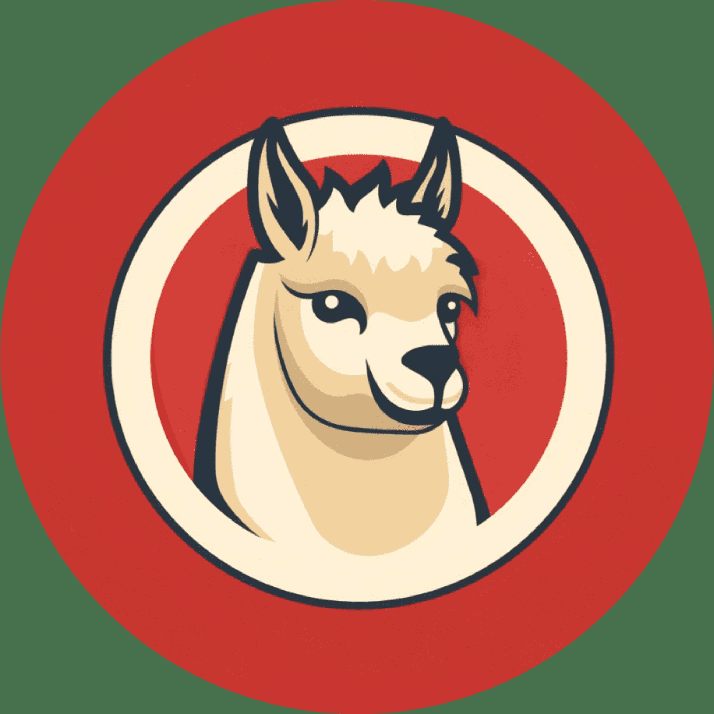
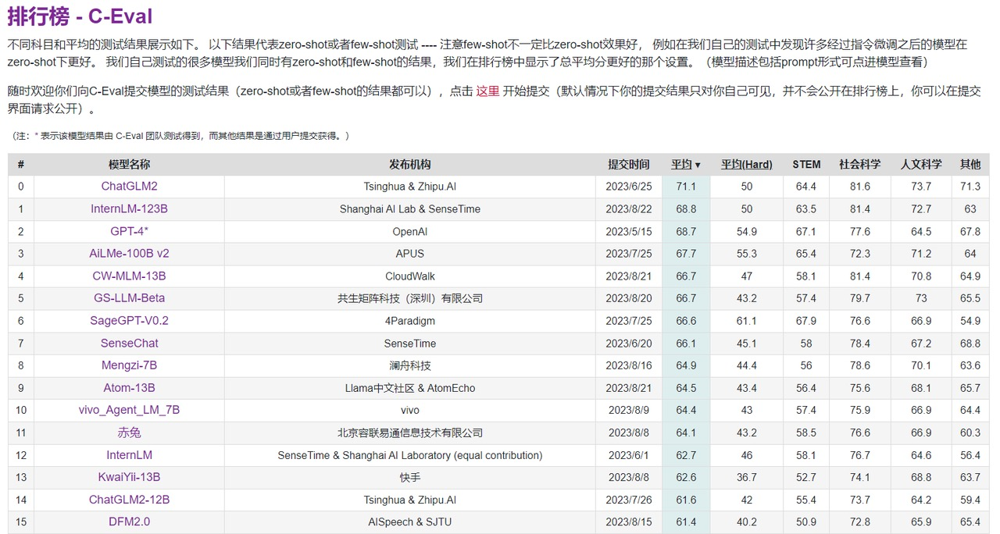
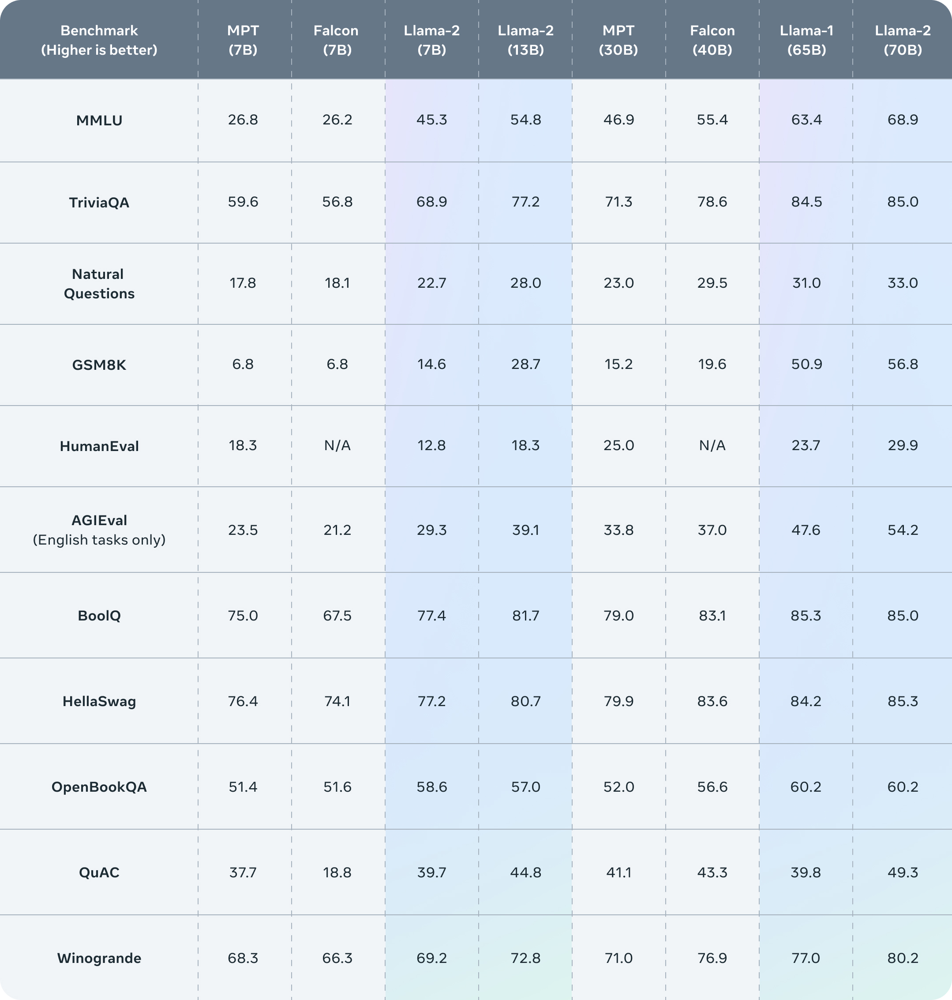
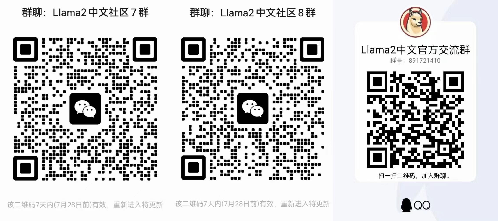

<h1 align="center">
  Llama2-Chinese
</h1>
<p align="center" width="100%">
  </a>
</p>
<p align="center">
  <font face="黑体" color=orange size="6"> 最好的中文Llama大模型 </font>
</p>
<p align="center">
  <a href="https://llama.family">在线体验：llama.family</a>
</p>
<p align="center">
  <a href="https://huggingface.co/FlagAlpha/Atom-7B">基于Llama2的开源中文预训练大模型Atom-7B</a>
</p>

</br></br>


## 🗂️ 内容导引
- [🐼 国内Llama2最新下载地址！](#-国内llama2最新下载地址)
- [🔥 社区介绍：Llama中文社区](#-社区介绍llama中文社区)
- [📢 社区公告](#-社区公告)
- [🔵 Atom模型](#-atom模型)
  - [大规模的中文数据预训练](#大规模的中文数据预训练)
  - [更高效的中文词表](#更高效的中文词表)
  - [自适应上下文扩展](#自适应上下文扩展)
- [📝 数据来源](#-数据来源)
- [⏬ 模型部署](#-模型部署)
  - [模型下载](#模型下载)
    - [Meta官方Llama2模型](#meta官方llama2模型)
    - [基于Llama2的中文微调模型](#基于llama2的中文微调模型)
    - [基于Llama2的中文预训练模型Atom](#基于llama2的中文预训练模型atom)
  - [模型调用代码示例](#模型调用代码示例)
  - [FastAPI接口搭建](#fastapi接口搭建)
  - [Gradio快速搭建问答平台](#gradio快速搭建问答平台)
  - [Docker部署问答接口](#docker部署问答接口)
- [💡 模型微调](#-模型微调)
  - [微调过程](#微调过程)
    - [Step1: 环境准备](#step1-环境准备)
    - [Step2: 数据准备](#step2-数据准备)
    - [Step3: 微调脚本](#step3-微调脚本)
  - [加载微调模型](#加载微调模型)
- [🍄 模型量化](#-模型量化)
- [🚀 推理加速](#-推理加速)
  - [lmdeploy](#lmdeploy)
  - [FasterTransformer](#fastertransformer)
  - [vLLM](#vllm)
- [🥇 模型评测](#-模型评测)
- [💪 外延能力](#-外延能力)
  - [LangChain](#langchain)
- [🐞 代码模型](#-代码模型)
- [📖 学习资料](#-学习资料)
  - [Meta官方对于Llama2的介绍](#meta官方对于llama2的介绍)
  - [Llama相关论文](#llama相关论文)
  - [Llama2的评测结果](#llama2的评测结果)
- [🎉 致谢](#-致谢)
- [🤔 问题反馈](#-问题反馈)


## 🐼 国内Llama2最新下载地址！

本仓库中的代码示例主要是基于Hugging Face版本参数进行调用，我们提供了脚本将Meta官网发布的模型参数转换为Hugging Face支持的格式，可以直接通过transformers库进行加载：[参数格式转化](https://github.com/FlagAlpha/Llama2-Chinese/blob/main/scripts/convert2hf/READMD.md)


<details>

- Llama2-7B官网版本：https://pan.xunlei.com/s/VN_kR2fwuJdG1F3CoF33rwpIA1?pwd=z9kf

- Llama2-7B-Chat官网版本：https://pan.xunlei.com/s/VN_kQa1_HBvV-X9QVI6jV2kOA1?pwd=xmra

- Llama2-13B官网版本：https://pan.xunlei.com/s/VN_izibaMDoptluWodzJw4cRA1?pwd=2qqb

- Llama2-13B-Chat官网版本：https://pan.xunlei.com/s/VN_iyyponyapjIDLXJCNfqy7A1?pwd=t3xw

- Llama2-7B Hugging Face版本：https://pan.xunlei.com/s/VN_t0dUikZqOwt-5DZWHuMvqA1?pwd=66ep

- Llama2-7B-Chat Hugging Face版本：https://pan.xunlei.com/s/VN_oaV4BpKFgKLto4KgOhBcaA1?pwd=ufir

- Llama2-13B Hugging Face版本：https://pan.xunlei.com/s/VN_yT_9G8xNOz0SDWQ7Mb_GZA1?pwd=yvgf
  
- Llama2-13B-Chat Hugging Face版本：https://pan.xunlei.com/s/VN_yA-9G34NGL9B79b3OQZZGA1?pwd=xqrg

- Llama2-70B-Chat Hugging Face版本：https://pan.xunlei.com/s/VNa_vCGzCy3h3N7oeFXs2W1hA1?pwd=uhxh#

- CodeLlama-7b官网版本：https://pan.baidu.com/s/1cIPzdNywWLvQI7_2QanOEQ?pwd=zfwi 

- CodeLlama-7b-Python官网版本：https://pan.baidu.com/s/1liY8klGoDagYbpw-g-oFag?pwd=i952

- CodeLlama-7b-Instruct官网版本：https://pan.baidu.com/s/108o9_DT2E_vfSGtOnDCQVw?pwd=zkt9

- CodeLlama-13b官网版本：https://pan.baidu.com/s/1lLaeHv0XEBv0iiZzI1dpnw?pwd=qn99

- CodeLlama-13b-Python官网版本：https://pan.baidu.com/s/1OLVfvZS_oqL3oqMKwsI87w?pwd=a78k

- CodeLlama-13b-Instruct官网版本：https://pan.baidu.com/s/1HyxJl4w8wElgkZRh2ATrXQ?pwd=seg6

</details>

## 🔥 社区介绍：Llama中文社区

欢迎来到Llama中文社区！我们是一个专注于Llama模型在中文方面的优化和上层建设的高级技术社区。
**\*基于大规模中文数据，从预训练开始对Llama2模型进行中文能力的持续迭代升级\***。
我们热忱欢迎对大模型LLM充满热情的开发者和研究者加入我们的行列。

<details>

### 为什么选择Llama2中文社区？
🚀 **高级工程师团队支持**：社区有一批专注为大家服务的NLP高级工程师，我们有着强大的技术支持和丰富的经验，为您提供专业的指导和帮助。

🎯 **中文优化**：我们致力于在Llama2模型的中文处理方面进行优化，探索适用于中文的最佳实践，以提升其性能和适应性。

💡 **创新交流**：我们拥有一支富有创造力和经验的社区成员团队，定期组织线上活动、技术研讨和经验分享，促进成员间的创新交流。

🌐 **全球联结**：我们欢迎来自世界各地的开发者加入社区，构建一个开放、多元化的学习和交流平台。

🤝 **开放共享**：我们鼓励社区成员开源分享代码和模型，推动合作共赢，共同促进中文NLP技术的发展。

### 社区活动
🗓️ **线上讲座**：邀请行业内专家进行线上讲座，分享Llama2在中文NLP领域的最新技术和应用，探讨前沿研究成果。

💻 **项目展示**：成员可展示自己在Llama2中文优化方面的项目成果，获得反馈和建议，促进项目协作。

📚 **学习资源**：社区维护丰富的学习资料库，包括教程、文档和论文解读，为成员提供全面的学习支持。

📝 **论文解读**：社区成员共同解读与Llama2相关的最新研究论文，深入理解前沿算法和方法。

🎉 **主题活动**：定期举办各类主题活动，包括挑战赛、黑客马拉松和技术沙龙，让社区成员在轻松愉快的氛围中交流和学习。

🌟 **奖励计划**：我们设立奖励计划，对社区中积极参与、贡献优秀的成员给予荣誉和奖励，激励更多优秀人才的加入。

📈 **技术咨询**：我们提供技术咨询服务，解答您在Llama2开发和优化过程中遇到的问题，助您快速攻克难关。

🚀 **项目合作**：鼓励成员间的项目合作，共同探索Llama2在实际应用中的潜力，打造创新解决方案。


### 立即加入我们！
📚 **愿景**：无论您是对Llama2已有研究和应用经验的专业开发者，还是对Llama2中文优化感兴趣并希望深入探索的新手，我们都热切期待您的加入。在Llama2中文社区，您将有机会与行业内顶尖人才共同交流，携手推动中文NLP技术的进步，开创更加美好的技术未来！

🔗 **温馨提示**：本社区为专业技术交流平台，我们热切期望志同道合的开发者和研究者加入。请遵守社区准则，共同维护积极向上的学习氛围，任何与Llama2无关的内容和广告将被清理。感谢您的理解和支持！

</details>

## 📢 社区公告

【最新】2023年8月28日：发布基于Llama2进行中文预训练的开源大模型[Atom-7B](https://huggingface.co/FlagAlpha/Atom-7B)，并将持续更新，详情参考[社区公众号文章](https://mp.weixin.qq.com/s/Bdx0JTVh1kgPn5ydYxIkEw)！

<details>

- 2023年8月26日：提供[FastAPI](#fastapi接口搭建)接口搭建脚本！

- 2023年8月26日：提供将Meta原始模型参数转换为兼容Hugging Face的[格式转化脚本](https://github.com/FlagAlpha/Llama2-Chinese/blob/main/scripts/convert2hf/READMD.md)！

- 2023年8月26日：新增[Code Llama](#-代码模型)模型！

- 2023年8月15日：新增[PEFT加载微调模型参数](#加载微调模型)的代码示例！

- 2023年8月14日：[大模型数据共享训练平台](https://llama.family)上线，没有算力也能参与大模型训练，社区每位成员贡献的数据都将决定模型能力的未来走向！

- 2023年8月3日：新增FasterTransformer和vLLM的GPU[推理加速](#-推理加速)支持！

- 2023年7月31日：【重磅】国内首个真正意义上的Llama2中文大模型发布！详情参见[社区公众号文章](https://mp.weixin.qq.com/s/lExUU7z_MvgJ7tzQPF8tUQ)

- 2023年7月28日：通过[Docker部署](#docker部署问答接口)问答接口！

- 2023年7月27日：新增[LangChain](#langchain)支持！

- 2023年7月26日：新增Llama2-13B中文微调参数的[4bit量化压缩版本](#-模型量化)！

- 2023年7月25日：社区微信公众号“Llama中文社区”欢迎大家关注，获取最新分享和动态！

- 2023年7月24日：[FlagAlpha](https://huggingface.co/FlagAlpha)新增Llama2-13B中文微调参数！

- 2023年7月24日：[llama.family](https://llama.family/)新增Llama2-70B在线体验！

- 2023年7月23日：Llama2中文微调参数发布至Hugging Face仓库[FlagAlpha](https://huggingface.co/FlagAlpha)！

- 2023年7月22日：Llama2在线体验链接[llama.family](https://llama.family/)上线，同时包含Meta原版和中文微调版本！

- 2023年7月21日：评测了Meta原始版Llama2 Chat模型的[中文问答能力](#-模型评测)！

- 2023年7月21日：新增Llama2模型的Hugging Face版本国内下载地址！

- 2023年7月20日：新增[飞书知识库文档](https://chinesellama.feishu.cn/wiki/space/7257824476874768388?ccm_open_type=lark_wiki_spaceLink)，欢迎大家一起共建！

- 2023年7月20日：国内Llama2最新下载地址上线！

- 2023年7月19日：正式启动Llama2模型的中文预训练，关注我们获取实时动态！

- 2023年7月19日：Llama2国内下载地址正在启动，敬请期待！

- 2023年7月19日：开启Llama2中文社区，欢迎大家加入！

</details>


## 🔵 Atom模型

**原子大模型Atom**由Llama中文社区和原子回声联合打造，在中文大模型评测榜单C-Eval中位居前十（8月21日评测提交时间）。
<p align="center" width="100%">

</p>

Atom系列模型包含Atom-7B和Atom-13B，基于Llama2做了中文能力的持续优化。Atom-7B目前已完全开源，支持商用，可在[Hugging Face](https://huggingface.co/FlagAlpha/Atom-7B)仓库获取模型。Atom大模型针对中文做了以下优化：

### 大规模的中文数据预训练

原子大模型Atom在Llama2的基础上，采用大规模的中文数据进行持续预训练，包含百科、书籍、博客、新闻、公告、小说、金融数据、法律数据、医疗数据、代码数据、专业论文数据、中文自然语言处理竞赛数据集等，详见[📝 数据来源](#-数据来源)。

同时对庞大的数据进行了过滤、打分、去重，筛选出超过1T token的高质量中文数据，持续不断加入训练迭代中。

### 更高效的中文词表
为了提高中文文本处理的效率，我们针对Llama2模型的词表进行了深度优化。首先，我们基于数百G的中文文本，在该模型词表的基础上扩展词库至65,000个单词。经过测试，我们的改进使得中文编码/解码速度提高了约350％。此外，我们还扩大了中文字符集的覆盖范围，包括所有emoji符号😊。这使得生成带有表情符号的文章更加高效。

### 自适应上下文扩展
Atom大模型默认支持4K上下文，利用位置插值PI和Neural Tangent Kernel （NTK）方法，经过微调可以将上下文长度扩增到32K。


## 📝 数据来源

我们通过以下数据来优化Llama2的中文能力:

| 类型                                                       | 描述                                                         |
| ---------------------------------------------------------- | ------------------------------------------------------------ |
| 网络数据                                                   | 互联网上公开的网络数据，挑选出去重后的高质量中文数据，涉及到百科、书籍、博客、新闻、公告、小说等高质量长文本数据。 |
| [Wikipedia](https://github.com/goldsmith/Wikipedia)        | 中文Wikipedia的数据                                          |
| [悟道](https://github.com/BAAI-WuDao/Model)                | 中文悟道开源的200G数据                                       |
| [Clue](https://github.com/CLUEbenchmark/CLUEDatasetSearch) | Clue开放的中文预训练数据，进行清洗后的高质量中文长文本数据   |
| 竞赛数据集                                                 | 近年来中文自然语言处理多任务竞赛数据集，约150个              |
| [MNBVC](https://github.com/esbatmop/MNBVC)                 | MNBVC 中清洗出来的部分数据集                                 |

**希望大家如果有较高质量的数据集能够提供给我们，不胜感激!💕💕**


## ⏬ 模型部署

Meta在🤗Hugging Face上提供了所有模型的下载链接：https://huggingface.co/meta-llama

Llama中文社区的中文模型下载链接：https://huggingface.co/FlagAlpha

### 模型下载

#### Meta官方Llama2模型

Llama2预训练模型包含7B、13B和70B三个版本。Llama2-Chat模型基于预训练模型进行了监督微调，具备更强的对话能力。

|  类别  | 模型名称   | 🤗模型加载名称             | 下载地址                                                     |
|  ----------  | ---------- | ------------------------- | --------------------- |
|  预训练  | Llama2-7B  | meta-llama/Llama-2-7b-hf  | [模型下载](https://huggingface.co/meta-llama/Llama-2-7b-hf)  |
|  预训练  | Llama2-13B | meta-llama/Llama-2-13b-hf | [模型下载](https://huggingface.co/meta-llama/Llama-2-13b-hf) |
|  预训练  | Llama2-70B | meta-llama/Llama-2-70b-hf | [模型下载](https://huggingface.co/meta-llama/Llama-2-70b-hf) |
|  Chat  | Llama2-7B-Chat  | meta-llama/Llama-2-7b-chat-hf  | [模型下载](https://huggingface.co/meta-llama/Llama-2-7b-chat-hf) |
|  Chat  | Llama2-13B-Chat | meta-llama/Llama-2-13b-chat-hf | [模型下载](https://huggingface.co/meta-llama/Llama-2-13b-chat-hf) |
|  Chat  | Llama2-70B-Chat | meta-llama/Llama-2-70b-chat-hf | [模型下载](https://huggingface.co/meta-llama/Llama-2-70b-chat-hf) |


#### 基于Llama2的中文微调模型

我们基于中文指令数据集对Llama2-Chat模型进行了微调，使得Llama2模型有着更强的中文对话能力。LoRA参数以及与基础模型合并的参数均已上传至[Hugging Face](https://huggingface.co/FlagAlpha)，目前包含7B和13B的模型。

|  类别  | 模型名称   | 🤗模型加载名称             | 基础模型版本 |    下载地址                                                     |
|  ----------  | ---------- | ------------- |  ----------------- | ------------------- |
|  合并参数 | Llama2-Chinese-7b-Chat | FlagAlpha/Llama2-Chinese-7b-Chat  |    meta-llama/Llama-2-7b-chat-hf       |[模型下载](https://huggingface.co/FlagAlpha/Llama2-Chinese-7b-Chat)  |
|  合并参数 | Llama2-Chinese-13b-Chat | FlagAlpha/Llama2-Chinese-13b-Chat|     meta-llama/Llama-2-13b-chat-hf     |[模型下载](https://huggingface.co/FlagAlpha/Llama2-Chinese-13b-Chat) |
|  LoRA参数 | Llama2-Chinese-7b-Chat-LoRA  | FlagAlpha/Llama2-Chinese-7b-Chat-LoRA  |     meta-llama/Llama-2-7b-chat-hf      |[模型下载](https://huggingface.co/FlagAlpha/Llama2-Chinese-7b-Chat-LoRA) |
|  LoRA参数 | Llama2-Chinese-13b-Chat-LoRA | FlagAlpha/Llama2-Chinese-13b-Chat-LoRA |     meta-llama/Llama-2-13b-chat-hf     |[模型下载](https://huggingface.co/FlagAlpha/Llama2-Chinese-13b-Chat-LoRA) |


#### 基于Llama2的中文预训练模型Atom

社区提供Atom-7B模型的开放下载，模型参数会持续不断更新，关于模型的进展详见社区官网[llama.family](https://llama.family)。

| 模型名称        | 🤗模型加载名称                  | 下载地址                                                     |
| --------------- | ------------------------------ | ------------------------------------------------------------ |
| Atom-7B  | FlagAlpha/Atom-7B  | [模型下载](https://huggingface.co/FlagAlpha/Atom-7B) |


### 模型调用代码示例

```python
import torch
from transformers import AutoTokenizer, AutoModelForCausalLM
model = AutoModelForCausalLM.from_pretrained('FlagAlpha/Atom-7B',device_map='auto',torch_dtype=torch.float16,load_in_8bit=True)
model =model.eval()
tokenizer = AutoTokenizer.from_pretrained('FlagAlpha/Atom-7B',use_fast=False)
tokenizer.pad_token = tokenizer.eos_token
input_ids = tokenizer(['<s>Human: 介绍一下中国\n</s><s>Assistant: '], return_tensors="pt",add_special_tokens=False).input_ids.to('cuda')        
generate_input = {
    "input_ids":input_ids,
    "max_new_tokens":512,
    "do_sample":True,
    "top_k":50,
    "top_p":0.95,
    "temperature":0.3,
    "repetition_penalty":1.3,
    "eos_token_id":tokenizer.eos_token_id,
    "bos_token_id":tokenizer.bos_token_id,
    "pad_token_id":tokenizer.pad_token_id
}
generate_ids  = model.generate(**generate_input)
text = tokenizer.decode(generate_ids[0])
print(text)
```

### FastAPI接口搭建

为了方便通过API方式调用模型，我们提供了脚本用来快速搭建[FastAPI](https://github.com/tiangolo/fastapi)接口，相关测试代码与API参数设置见[API 调用](https://github.com/FlagAlpha/Llama2-Chinese/blob/main/scripts/api/READMD.md)。

### Gradio快速搭建问答平台

基于gradio搭建的问答界面，实现了流式的输出，将下面代码复制到控制台运行，以下代码以Atom-7B模型为例，<font color="#006600">不同模型只需修改一下代码里的模型名称就好了😊</font><br/>
```
python examples/chat_gradio.py --model_name_or_path FlagAlpha/Atom-7B
```

### Docker部署问答接口
详情参见：[Docker部署](https://github.com/FlagAlpha/Llama2-Chinese/blob/main/docs/chat_gradio_guide.md)

第一步：准备docker镜像，通过docker容器启动[chat_gradio.py](../examples/chat_gradio.py)
```bash
git clone https://github.com/FlagAlpha/Llama2-Chinese.git

cd Llama2-Chinese

docker build -f docker/Dockerfile -t flagalpha/llama2-chinese-7b:gradio .
```

第二步：通过docker-compose启动chat_gradio
```bash
cd Llama2-Chinese/docker
doker-compose up -d --build
```


## 💡 模型微调

本仓库中提供了基于LoRA的微调代码，未来我们将会扩展更多的微调算法，敬请期待！关于LoRA的详细介绍可以参考论文“[LoRA: Low-Rank Adaptation of Large Language Models](https://arxiv.org/abs/2106.09685)”以及微软Github仓库[LoRA](https://github.com/microsoft/LoRA)。

### 微调过程

#### Step1: 环境准备

根据[requirements.txt](https://github.com/FlagAlpha/Llama2-Chinese/blob/main/requirements.txt)安装对应的环境依赖。

#### Step2: 数据准备
在data目录下提供了一份用于模型sft的数据样例：
- 训练数据：[data/train_sft.csv](https://github.com/FlagAlpha/Llama2-Chinese/blob/main/data/train_sft.csv)
- 验证数据：[data/dev_sft.csv](https://github.com/FlagAlpha/Llama2-Chinese/blob/main/data/dev_sft.csv)

每个csv文件中包含一列“text”，每一行为一个训练样例，每个训练样例按照以下格式将问题和答案组织为模型输入，您可以按照以下格式自定义训练和验证数据集：
```
"<s>Human: "+问题+"\n</s><s>Assistant: "+答案
```
例如，
```
<s>Human: 用一句话描述地球为什么是独一无二的。</s><s>Assistant: 因为地球是目前为止唯一已知存在生命的行星。</s>
```

#### Step3: 微调脚本

我们提供了用于微调的脚本[train/sft/finetune.sh](https://github.com/FlagAlpha/Llama2-Chinese/blob/main/train/sft/finetune.sh)，通过修改脚本的部分参数实现模型的微调，关于微调的具体代码见[train/sft/finetune_clm_lora.py](https://github.com/FlagAlpha/Llama2-Chinese/blob/main/train/sft/finetune_clm_lora.py)，单机多卡的微调可以通过修改脚本中的`--include localhost:0`来实现。


### 加载微调模型
微调模型参数见：[基于Llama2的中文微调模型](#基于llama2的中文微调模型)，LoRA参数需要和基础模型参数结合使用。

通过[PEFT](https://github.com/huggingface/peft)加载预训练模型参数和微调模型参数，以下示例代码中，base_model_name_or_path为预训练模型参数保存路径，finetune_model_path为微调模型参数保存路径。

```python
import torch
from transformers import AutoTokenizer, AutoModelForCausalLM
from peft import PeftModel,PeftConfig
# 例如: finetune_model_path='FlagAlpha/Llama2-Chinese-7b-Chat-LoRA'
finetune_model_path=''  
config = PeftConfig.from_pretrained(finetune_model_path)
# 例如: base_model_name_or_path='meta-llama/Llama-2-7b-chat'
tokenizer = AutoTokenizer.from_pretrained(config.base_model_name_or_path,use_fast=False)
tokenizer.pad_token = tokenizer.eos_token
model = AutoModelForCausalLM.from_pretrained(config.base_model_name_or_path,device_map='auto',torch_dtype=torch.float16,load_in_8bit=True)
model = PeftModel.from_pretrained(model, finetune_model_path, device_map={"": 0})
model =model.eval()
input_ids = tokenizer(['<s>Human: 介绍一下北京\n</s><s>Assistant: '], return_tensors="pt",add_special_tokens=False).input_ids.to('cuda')        
generate_input = {
    "input_ids":input_ids,
    "max_new_tokens":512,
    "do_sample":True,
    "top_k":50,
    "top_p":0.95,
    "temperature":0.3,
    "repetition_penalty":1.3,
    "eos_token_id":tokenizer.eos_token_id,
    "bos_token_id":tokenizer.bos_token_id,
    "pad_token_id":tokenizer.pad_token_id
}
generate_ids  = model.generate(**generate_input)
text = tokenizer.decode(generate_ids[0])
print(text)
```


<!-- ## 🚀 未来计划 -->


## 🍄 模型量化
我们对中文微调的模型参数进行了量化，方便以更少的计算资源运行。目前已经在[Hugging Face](https://huggingface.co/FlagAlpha)上传了13B中文微调模型[FlagAlpha/Llama2-Chinese-13b-Chat](https://huggingface.co/FlagAlpha/Llama2-Chinese-13b-Chat)的4bit压缩版本[FlagAlpha/Llama2-Chinese-13b-Chat-4bit](https://huggingface.co/FlagAlpha/Llama2-Chinese-13b-Chat-4bit)，具体调用方式如下：
```python
from transformers import AutoTokenizer
from auto_gptq import AutoGPTQForCausalLM
model = AutoGPTQForCausalLM.from_quantized('FlagAlpha/Llama2-Chinese-13b-Chat-4bit', device="cuda:0")
tokenizer = AutoTokenizer.from_pretrained('FlagAlpha/Llama2-Chinese-13b-Chat-4bit',use_fast=False)
input_ids = tokenizer(['<s>Human: 怎么登上火星\n</s><s>Assistant: '], return_tensors="pt",add_special_tokens=False).input_ids.to('cuda')        
generate_input = {
    "input_ids":input_ids,
    "max_new_tokens":512,
    "do_sample":True,
    "top_k":50,
    "top_p":0.95,
    "temperature":0.3,
    "repetition_penalty":1.3,
    "eos_token_id":tokenizer.eos_token_id,
    "bos_token_id":tokenizer.bos_token_id,
    "pad_token_id":tokenizer.pad_token_id
}
generate_ids  = model.generate(**generate_input)
text = tokenizer.decode(generate_ids[0])
print(text)
```

## 🚀 推理加速
随着大模型参数规模的不断增长，在有限的算力资源下，提升模型的推理速度逐渐变为一个重要的研究方向。常用的推理加速框架包含 lmdeploy、FasterTransformer 和 vLLM 等。

### lmdeploy
[lmdeploy](https://github.com/InternLM/lmdeploy/) 由上海人工智能实验室开发，推理使用 C++/CUDA，对外提供 python/gRPC/http 接口和 WebUI 界面，支持 tensor parallel 分布式推理、支持 fp16/weight int4/kv cache int8 量化。

详细的推理文档见：[inference-speed/GPU/lmdeploy_example](https://github.com/FlagAlpha/Llama2-Chinese/tree/main/inference-speed/GPU/lmdeploy_example)

### FasterTransformer
[FasterTransformer](https://github.com/NVIDIA/FasterTransformer)由NVIDIA开发，采用C++/CUDA编写，支持分布式推理，transformer编码器和解码器均可进行加速。
通过FasterTransformer和[Triton](https://github.com/openai/triton)加速LLama2模型推理，目前支持FP16或者Int8推理，Int4目前还不支持。

详细的推理文档见：[inference-speed/GPU/FasterTransformer_example](https://github.com/FlagAlpha/Llama2-Chinese/tree/main/inference-speed/GPU/FasterTransformer_example)

### vLLM
[vLLM](https://github.com/vllm-project/vllm)由加州大学伯克利分校开发，核心技术是PageAttention，吞吐量比HuggingFace Transformers高出24倍。相较与FasterTrainsformer，vLLM更加的简单易用，不需要额外进行模型的转换，支持fp16推理。

详细的推理文档见：[inference-speed/GPU/vllm_example](https://github.com/FlagAlpha/Llama2-Chinese/blob/main/inference-speed/GPU/vllm_example/README.md)


## 🥇 模型评测
为了能够更加清晰地了解Llama2模型的中文问答能力，我们筛选了一些具有代表性的中文问题，对Llama2模型进行提问。我们测试的模型包含Meta公开的Llama2-7B-Chat和Llama2-13B-Chat两个版本，没有做任何微调和训练。测试问题筛选自[AtomBulb](https://github.com/AtomEcho/AtomBulb)，共95个测试问题，包含：通用知识、语言理解、创作能力、逻辑推理、代码编程、工作技能、使用工具、人格特征八个大的类别。

测试中使用的Prompt如下，例如对于问题“列出5种可以改善睡眠质量的方法”：
```
[INST] 
<<SYS>>
You are a helpful, respectful and honest assistant. Always answer as helpfully as possible, while being safe.  Your answers should not include any harmful, unethical, racist, sexist, toxic, dangerous, or illegal content. Please ensure that your responses are socially unbiased and positive in nature. The answer always been translate into Chinese language.

If a question does not make any sense, or is not factually coherent, explain why instead of answering something not correct. If you don't know the answer to a question, please don't share false information.

The answer always been translate into Chinese language.
<</SYS>>

列出5种可以改善睡眠质量的方法
[/INST]
```
Llama2-7B-Chat的测试结果见[meta_eval_7B.md](assets/meta_eval_7B.md)，Llama2-13B-Chat的测试结果见[meta_eval_13B.md](assets/meta_eval_13B.md)。

通过测试我们发现，Meta原始的Llama2 Chat模型对于中文问答的对齐效果一般，大部分情况下都不能给出中文回答，或者是中英文混杂的形式。因此，基于中文数据对Llama2模型进行训练和微调十分必要，我们的中文版Llama2模型也已经在训练中，近期将对社区开放。


## 💪 外延能力

除了持续增强大模型内在的知识储备、通用理解、逻辑推理和想象能力等，未来，我们也会不断丰富大模型的外延能力，例如知识库检索、计算工具、WolframAlpha、操作软件等。
我们首先集成了LangChain框架，可以更方便地基于Llama2开发文档检索、问答机器人和智能体应用等，关于LangChain的更多介绍参见[LangChain](https://github.com/langchain-ai/langchain)。
### LangChain
针对LangChain框架封装的Llama2 LLM类见[examples/llama2_for_langchain.py](https://github.com/FlagAlpha/Llama2-Chinese/blob/main/examples/llama2_for_langchain.py)，简单的调用代码示例如下：
```python
from llama2_for_langchain import Llama2

# 这里以调用4bit量化压缩的Llama2-Chinese参数FlagAlpha/Llama2-Chinese-13b-Chat-4bit为例
llm = Llama2(model_name_or_path='FlagAlpha/Llama2-Chinese-13b-Chat-4bit', bit4=True)

while True:
    human_input = input("Human: ")
    response = llm(human_input)
    print(f"Llama2: {response}")
```

## 🐞 代码模型
Meta官方在2023年8月24日发布了发布了Code Llama，基于代码数据对Llama2进行了微调，提供三个不同功能的版本：基础模型（Code Llama）、Python专用模型（Code Llama - Python）和指令跟随模型（Code Llama - Instruct），包含7B、13B、34B三种不同参数规模。不同模型能力区别如下表所示：

|  模型类别          |        模型名称         | 代码续写 | 代码填充 | 指令编程 |
|-----------------------|------------------------|------|------|------|
| Code Llama            | CodeLlama-7b           | ✅    | ✅    | ❌    |
|                       | CodeLlama-13b          | ✅    | ✅    | ❌    |
|                       | CodeLlama-34b          | ✅    | ❌    | ❌    |
| Code Llama - Python   | CodeLlama-7b-Python    | ✅    | ❌    | ❌    |
|                       | CodeLlama-13b-Python   | ✅    | ❌    | ❌    |
|                       | CodeLlama-34b-Python   | ✅    | ❌    | ❌    |
| Code Llama - Instruct | CodeLlama-7b-Instruct  | ❌    | ✅    | ✅    |
|                       | CodeLlama-13b-Instruct | ❌    | ✅    | ✅    |
|                       | CodeLlama-34b-Instruct | ❌    | ❌    | ✅    |

我们提供了Code Llama的[国内下载链接](#-国内llama2最新下载地址上线)以及在线体验地址[llama.family](https://llama.family/)，关于Code Llama的详细信息可以参考官方Github仓库[codellama](https://github.com/facebookresearch/codellama)。


## 📖 学习资料
### Meta官方对于[Llama2](https://ai.meta.com/llama)的介绍
自从Meta公司发布第一代LLaMA模型以来，羊驼模型家族繁荣发展。近期Meta发布了Llama2版本，开源可商用，在模型和效果上有了重大更新。Llama2总共公布了7B、13B和70B三种参数大小的模型。相比于LLaMA，Llama2的训练数据达到了2万亿token，上下文长度也由之前的2048升级到4096，可以理解和生成更长的文本。Llama2 Chat模型基于100万人类标记数据微调得到，在英文对话上达到了接近ChatGPT的效果。      

### Llama相关论文
* [LLaMA: Open and Efficient Foundation Language Models](https://arxiv.org/abs/2302.13971)
* [Llama 2: Open Foundation and Fine-Tuned Chat Models](https://arxiv.org/abs/2307.09288)
* [Code Llama: Open Foundation Models for Code](https://ai.meta.com/research/publications/code-llama-open-foundation-models-for-code/)
### Llama2的评测结果
<p align="center" width="100%">

</p>


## 🎉 致谢

感谢原子回声[AtomEcho](https://github.com/AtomEcho)团队的技术和资源支持！

感谢 @xzsGenius 对Llama2中文社区的贡献！

感谢 @Z Potentials社区对Llama2中文社区的支持！


## 🤔 问题反馈

如有问题，请在GitHub Issue中提交，在提交问题之前，请先查阅以往的issue是否能解决你的问题。

礼貌地提出问题，构建和谐的讨论社区。

加入[飞书知识库](https://chinesellama.feishu.cn/wiki/space/7257824476874768388?ccm_open_type=lark_wiki_spaceLink)，一起共建社区文档。

加入微信群讨论😍😍

<p align="center" width="100%">

</p>

<p align="center" width="100%">

</p>
