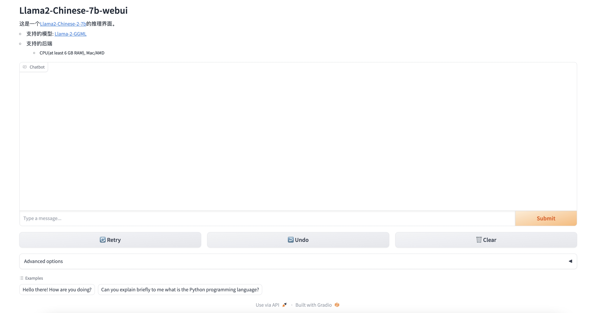

# 6G内存运行Llama2-Chinese-7B-chat模型

## 第一步：
从huggingface下载 [Llama2-Chinese-7b-Chat-GGML](https://huggingface.co/FlagAlpha/Llama2-Chinese-7b-Chat-GGML)模型放到本地的某一目录。

## 第二步：

执行python程序
```
git clone  https://github.com/Rayrtfr/llama2-webui.git

cd llama2-webui && pip install -r requirements.txt

# 注意这里的/path/ggml-model-q4_0.bin换成你本地下载的模型路径
python app_4bit_ggml.py \
--model_path /path/ggml-model-q4_0.bin
```


本地浏览器打开:  [http://127.0.0.1:8090](http://127.0.0.1:8090)

<p align="center" width="100%">

</p>
